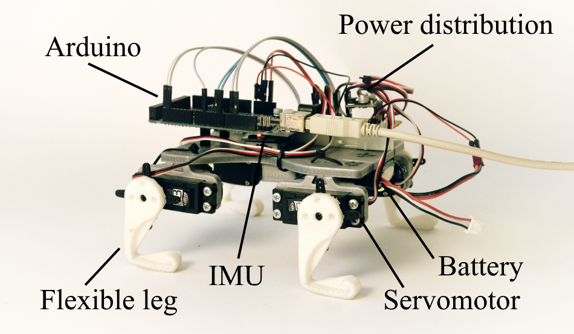
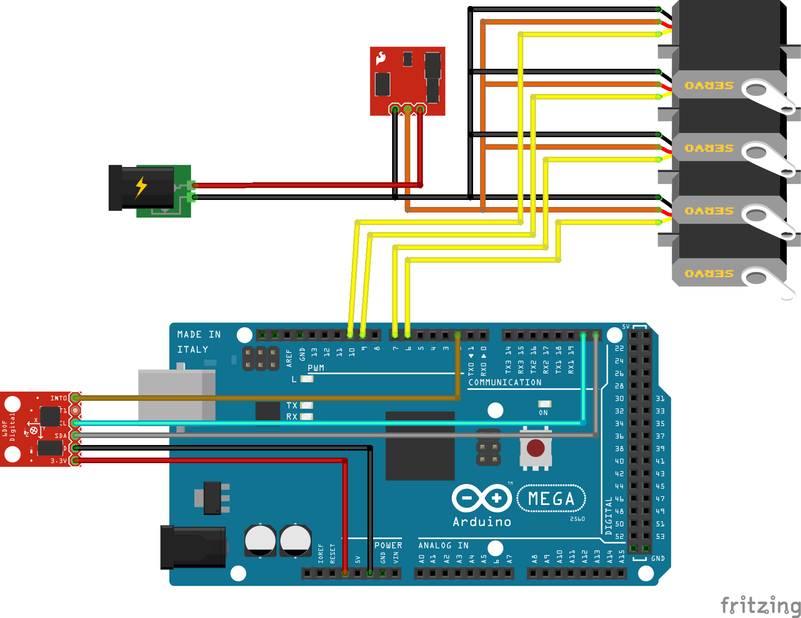

# Demo Puppy

This is a fork of the demoPuppy which was originally designed by K. Dermitzakis [dermitza](https://github.com/dermitza). The original files are described on his [website](https://dermitza.github.io/demoPuppy/).

## Modified files
New models were added which are compatible with the original models. They include
- Servo holders for cheap Carson CS-3 standard size servos
- Flexible legs which can be printed in one piece with flexible filament. We used [Ninjatek's Ninjaflex](https://ninjatek.com/products/filaments/ninjaflex/).
- A one piece body unit which has the holes to hold a Arduino Mega
- A holder for the IMU "MPU6050" which fits to the one piece body

All included files can be 3D printed. We used an Ultimaker2.

The new models are included in the [V5 pack](packs/puppy_v05_one_part_stl.zip). This configuration is shown in the following image:

## Electronics

In our configuration puppy has an IMU and 4 servos for the legs. They can be wired as shown in the following graphic

- The red chip on the left is the MPU6050
- the red chip on the top is a voltage regulator. It should fit the requirements of the Servos.
- We use an Arduino Mega

## Arduino program

The arduino program found in arduino/puppy_base is compatible with the wiring shown before.

### Installation
Many parts of the program are identical with the code in the [tinyIMU](https://github.com/AndreasGerken/tinyIMU_arduino) repository.
This repository has a step by step instruction how to install the package which have to be followed to use this package.

### Features
- The program is [ROS](http://www.ros.org/) enabled and can communicate to a ros master via [rosserial](http://wiki.ros.org/rosserial)
- The program reads the IMU measurements with a high frequency (~300Hz), and publishes a smoothed version at around 20Hz with the topic "\tinyIMU" and in the tinyIMU data type to reduce data traffic.
- The program subscribes to motor commands with the topic "\puppyMotor" and gives the corresponding PWM commands to the servos. The value range is between (-32768 and 32768)
- The program runs a diagnostic about the load percentage in it's loop and publishes it with the topic "\timing"

## Additional repositories
 - To transfer the tinyIMU messages to a standard IMU message the package [tinyIMU_relay](https://github.com/superjax/tinyIMU_relay) can be used. The package has a scaling feature to convert the raw values to ROS standard units.
 - The repository [smp_control](https://github.com/AndreasGerken/smp_control) includes configuration files for self exploration of this robot.
